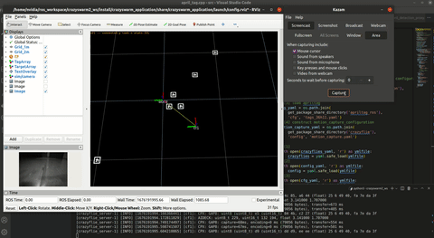
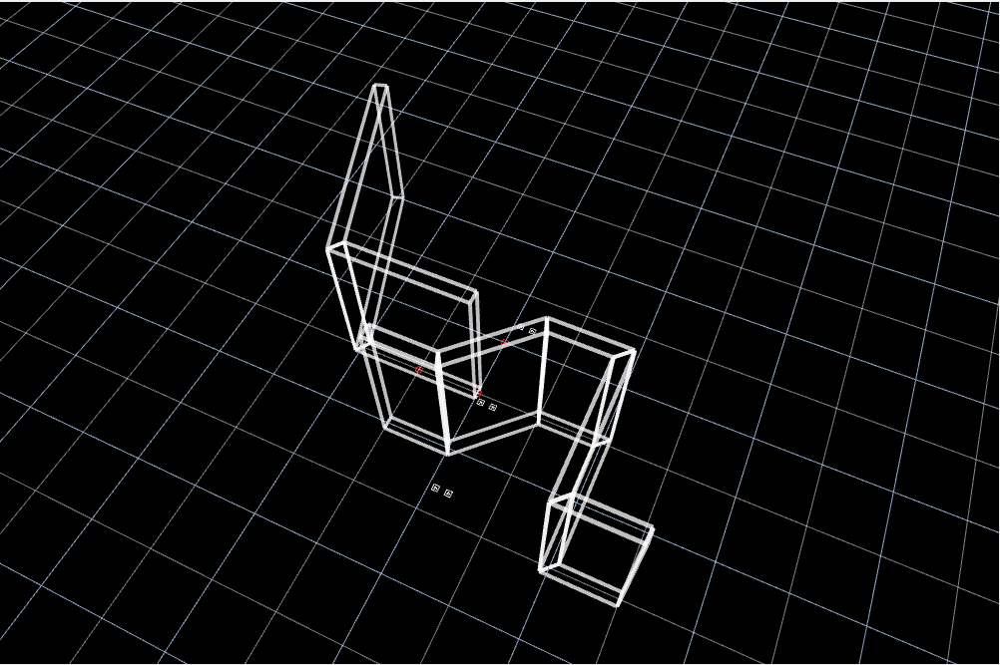
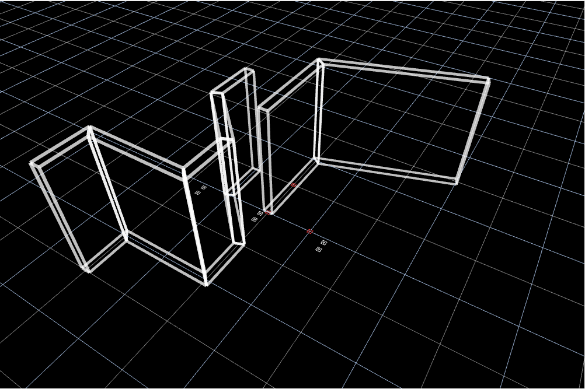

# STAR (Swarm Technology for Aerial Robotics Research)
STAR ia a framework developed explicitly to improve the accessibility of aerial swarm research experiments. Our framework introduces a swarm architecture based on the Crazyflie, a low-cost, open-source, palm-sized aerial platform, well suited for experimental swarm algorithms. To augment cost-effectiveness and mitigate the limitations of employing low-cost robots in experiments, we propose a landmark-based localization module leveraging fiducial markers. This module, also serving as a target detection module, enhances the adaptability and versatility of the framework. Additionally, collision and obstacle avoidance are implemented through velocity obstacles. The presented work strives to bridge the gap between theoretical advances and tangible implementations, thus fostering progress in the field.

* This package was tested on `ROS-Galactic Ubuntu 20.04`.

## Important Dependencies
1. [For relocalization] `gtsam` at https://github.com/borglab/gtsam using version 4.1.1

## Simulation
The task manager supports simulation for sanity check of the configurations set.


## Landmark-based localisation
This module supports landmark-based localisation which correct the pose of the drone using fiducial markers.


## Obstacles generation
Developers has the options to develop polygon shapes to represent obstacles in the environment. The obstacle are used for virtusal collison avoidance and the safety buffer from the obstacles can be adjusted as well.
| Perspective1 | Perspective2 |
| :---: | :-----------: |
|  |  |

## Simulation
The task manager supports simulation for sanity check of the configurations set.


## Environment Setup
1. Create workspace
```bash
cd <to-your-preferred-directory>
mkdir -p STAR_ws/src
cd <to-your-preferred-directory>/STAR_ws/src

# git clone these 6 repositories
git clone git@github.com:STAR-swarm/STAR.git
move all the repo within STAR to src
git clone git@github.com:teamspatzenhirn/rviz_2d_overlay_plugins.git
```

2. Install `Apriltag` dependencies
```bash
sudo apt-get install -y \
ros-galactic-apriltag \
libboost-program-options-dev \
libusb-1.0-0-dev
pip3 install rowan
```

3. Install `gtsam` from source
```bash
#install gtsam
cd <to-your-preferred-directory>
git clone https://github.com/borglab/gtsam
cd gtsam && git checkout 4.1.1
mkdir build
cd build
cmake ..
make
sudo make install
# from here you can add the path into the library path
export LD_LIBRARY_PATH=/usr/local/lib/:$LD_LIBRARY_PATH
# or you can add it into .bashrc
```

4. Compile and source
- Be warned to deactivate `conda` env if applicable before `colcon build`
```bash
# Using your ROS2 Distribution
echo $ROS_DISTRO
source /opt/ros/$ROS_DISTRO/setup.bash
# build
cd <location-of-crazyswarm2_ws>
# build the crazyswarm environment
colcon build --symlink-install
# source the bash file
source install/setup.bash
```

## Further Information/Help About the Package

### Mission Files
For mission files, there are various missions sample files that are in `launch/mission/*`, they are in yaml format and more information can be seen in `launch/config.yaml`.

Launching `ros2 launch crazyswarm_application mission.py` will load the files after you have compiled and you can choose it as an input
```
user@user:~/crazyswarm2_ws$ ros2 launch crazyswarm_application mission.py
[INFO] [launch]: Default logging verbosity is set to INFO
0 .  1_agent_high.yaml
1 .  takeoff_land.yaml
2 .  1_agent_move.yaml
3 .  sample.yaml
4 .  empty.yaml
5 .  sample1.yaml
6 .  3_agent_orca.yaml
7 .  3_agent_orca_eliminate.yaml
What is your mission file?
1
Mission chosen is takeoff_land.yaml
```

### Environment
An environment consists of 2 things, obstacles and fiducial markers, which can be used for landmark localisation and other task depending on usage. To create an environment:
1. Add in a custom environment file in `launch/environment` (you can take reference to the samples
2. In `config.yaml` add in the yaml name in `environment_file` parameter

### Launch
There will need to be 4 terminals at least, to launch all the relevant packages
```bash
# 1. Launch crazyswarm server
ros2 launch crazyflie launch.py rviz:=none # Real
# or
ros2 launch crazyflie launch.py backend:=sim rviz:=none # Simulation

# 2. Launch main crazyswarm_application server
ros2 launch crazyswarm_application launch.py sim:=true # main handler node for simulation
# or
ros2 launch crazyswarm_application launch.py # main handler node for real

# 3. Launch crazyswarm_application mission file
ros2 launch crazyswarm_application mission.py # start mission

# 4. Launch crazyswarm_application visualization
ros2 launch crazyswarm_application rviz.py # visualization
```

For real life application, to activate the `landmark-based localisation` portion of this repository, `apriltag_ros` will have to be activated, this can be seen in `app_w_april.py` under the `camera_node` and `tag_node`.

### Mission Node
The mission node will evaluate the mission files that are represented by the command sequence, and the following elaborates the mission structure and content
```yaml
# Example command will be like this
command_sequence: [
  "[1]", "[2]", "[3]", "[4]", "[5]"]
# command_sequence index
# [1] command:
#   1. takeoff = Taking off sequence
#   2. hold = Wait for certain time
#   3. goto = Move to location
#   4. goto_velocity = Move to location with velocity control
#   5. external = Wait for external command
#   6. land = Landing sequence

# [2] to wait before the next command:
#   1. conc = Go to the next command without waiting for this
#   2. wait = Wait for this command

# [3] drone number involved
#   1. "all"
#   2. "cfX" = split the cfs by underscore etc "cf1_cf2_cf3"

# [4] duration (only applicable to hold) in ms, if nothing leave empty ""

# [5] pose in XYZ "1 1 1", if nothing leave empty ""
```

For running `external modules` please refer to `launch/mission/external_sample.yaml` where the example command sequence is shown below, a timeout period is given, so that if there is no command given during a timeframe, it will be considered completed and move on to the next mission in the list
```yaml
"external", "wait", "cf1", "", ""
```